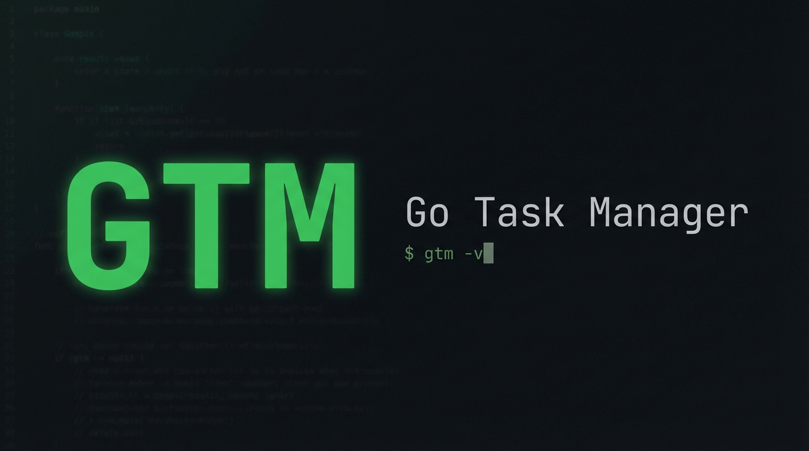
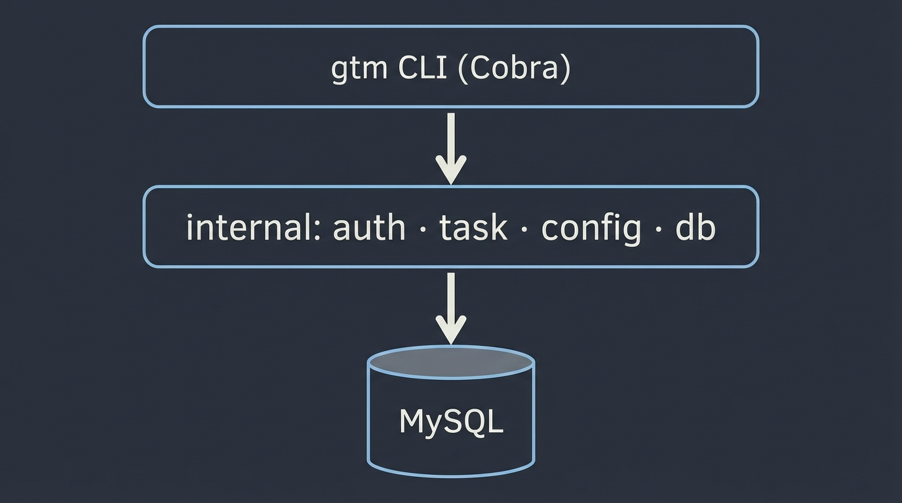

📝 Go Task Manager (GTM)
========================



**Go Task Manager** es una herramienta de línea de comandos (CLI) ligera y rápida diseñada para ayudarte a organizar tu flujo de trabajo diario sin salir de la terminal.

Recursos graficos del README en [docs/images/](docs/images/).

🚀 Características principales
------------------------------

*   **Gestión Rápida:** Añade, lista y elimina tareas en segundos.
    
*   **Estados:** Marca tareas como pendientes o completadas.
    
*   **Persistencia de Datos:** Tareas y **usuarios** (credenciales + quick-connect) en **MySQL**; sesion local (`session.json`) y archivos `quick_connect_*.json` en el directorio de configuracion del usuario.
    
*   **Arquitectura Limpia:** Código organizado siguiendo las mejores prácticas de Go.
    

🛠️ Instalación
---------------

### Requisitos previos

*   **Go** (versión 1.21 o superior recomendada)
*   **Cliente MySQL** en PATH (`mysql --version`; los scripts `install.sh` / `install.ps1` no validan que el servidor este en marcha)
    

### Pasos para instalar

1.  Clona el repositorio:
    `git clone https://github.com/tu-usuario/go-task-manager.git`
2.  Entra al proyecto:
    `cd go-task-manager`
3.  Configura MySQL en `.env` a partir de `.envExample` (`DB_HOST`, `DB_PORT`, `DB_USER`, `DB_PASSWORD`, `DB_NAME`).
4.  Usa el instalador segun tu sistema operativo:
    - Linux/macOS: `bash scripts/install.sh`
    - Windows (PowerShell): `powershell -ExecutionPolicy Bypass -File .\scripts\install.ps1`

El instalador deja una copia en **`~/.local/bin/gtm`** (`gtm.exe` en Windows: `%USERPROFILE%\.local\bin\`). Asi puedes ejecutar **`gtm -v`**, **`gtm task list`**, etc. **desde cualquier carpeta**, no solo dentro del repo.

- **Linux/macOS:** si `~/.local/bin` no esta en tu `PATH`, el script indica la linea `export PATH=...` para pegar en `~/.bashrc`, `~/.zshrc` o similar; abre una terminal nueva.
- **Windows:** el script **anade** `%USERPROFILE%\.local\bin` al PATH del usuario si faltaba; si una terminal ya abierta no encuentra `gtm`, cerrala y abre otra.

Alternativa sin script: anade manualmente la carpeta `bin` del repo a tu PATH, o usa la ruta completa al binario.

📂 Estructura del Proyecto
--------------------------



El proyecto sigue una estructura modular para facilitar su mantenimiento:

*   cmd/: Puntos de entrada de la aplicación.
    
*   internal/: Lógica de negocio (gestión de tareas y almacenamiento).
    
*   pkg/: Paquetes de utilidad compartidos.
    

💻 Uso
------

Los instaladores generan siempre el binario **`gtm`** (`gtm.exe` en Windows), alineado con `DefaultName` en [internal/config/config.go](internal/config/config.go). Tambien puedes usar `go run .`.

### Autenticacion (MySQL)

Los comandos `login`, `login --signup` y `switch` requieren las mismas variables `DB_*` que las tareas. La primera ejecucion crea la tabla `users` si no existe. `logout` solo borra la sesion local.

- `login` / `login --signup` / `logout` / `switch`

### Tareas (MySQL)

La primera ejecucion de un subcomando `task` crea la tabla `tasks` si no existe. Las migraciones posteriores añaden columnas nuevas (p. ej. `depends_on_id`) de forma idempotente.

Cada tarea puede **depender de otra** (`depends_on_id`, UUID de otra fila en `tasks`). Si borras la tarea de la que se dependia, MySQL pone `depends_on_id` en NULL (`ON DELETE SET NULL`). No se permiten dependencias circulares.

| Comando | Descripcion |
|--------|-------------|
| `task add` (sin flags) | Modo interactivo por terminal. |
| `task add --name "..." --description "..." [--relevance N] [--due YYYY-MM-DD] [--depends-on UUID]` | Crea tarea (id UUID); imprime el id. |
| `task list` | Lista ordenada; columna **DEPENDE_DE** (nombre de la tarea padre o prefijo de UUID). |
| `task get [id]` | Detalle; incluye `depende_de`; sin `id` lo pide por terminal. |
| `task update [id]` | Sin flags: modo interactivo. Flags: `--depends-on`, `--clear-depends-on`, `--clear-due`, etc. |
| `task pick` | Elige **una tarea al azar** y muestra el mismo detalle que `get`. |
| `task delete [id]` | Elimina; sin `id` lo pide por terminal. |
| `task add-prompt` | Crea una o varias tareas a partir de texto libre usando un **LLM** (Gemini u OpenAI-compatible). Variables `GTM_LLM_API_KEY`, `GTM_LLM_PROVIDER` (`gemini` o `openai`), `GTM_LLM_MODEL`; opcional `GTM_LLM_BASE_URL` para endpoints compatibles con OpenAI. Salida: un UUID por linea. No subas la API key al repositorio. |

Ejemplo:

```bash
./bin/gtm task add --name "Reunion" --description "Cliente X" --relevance 8 --due 2026-04-15
./bin/gtm task list
```

Con LLM configurado en `.env` (`GTM_LLM_API_KEY`, etc.):

```bash
./bin/gtm task add-prompt --prompt "Recordatorio: revisar informe el viernes; relevancia alta"
```

Con el binario en PATH (tras el instalador, ver arriba): `gtm -v` y `gtm task list` desde cualquier directorio.

Solo en el repo, sin PATH global:

- Linux/macOS: `./bin/gtm`
- Windows: `.\bin\gtm.exe`

🔧 Stack Tecnológico
--------------------

*   **Lenguaje:** [Go](https://go.dev/)
    
*   **Librería CLI:** [Cobra](https://github.com/spf13/cobra) (opcional, para subcomandos complejos)
    
*   **Persistencia:** MySQL (`tasks`, `users`); JSON local (sesion y quick_connect por archivo)
    

🤝 Contribuciones
-----------------

Si quieres contribuir:

1.  Haz un **Fork** del proyecto.
    
2.  Crea una rama con tu mejora: git checkout -b feature/nueva-mejora.
    
3.  Haz un **Commit**: git commit -m 'Añadida funcionalidad X'.
    
4.  Haz **Push**: git push origin feature/nueva-mejora.
    
5.  Abre un **Pull Request**.